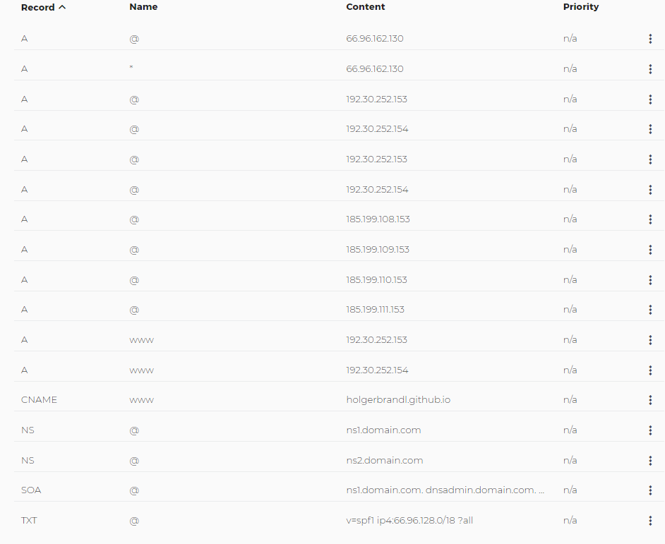
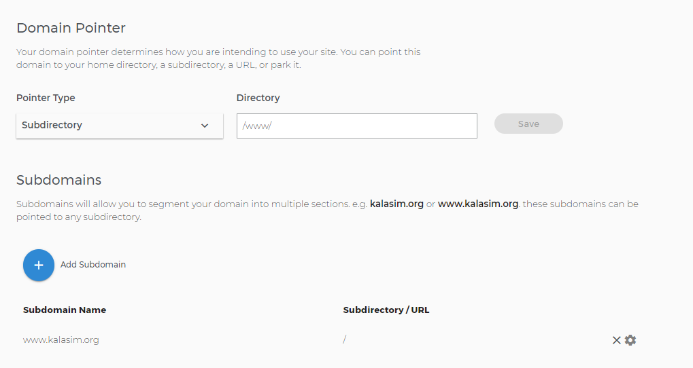

# Kalasim Developer Documentation & Notes

## domain config

https://medium.com/@hossainkhan/using-custom-domain-for-github-pages-86b303d3918a

https://stackoverflow.com/questions/30833110/github-pages-custom-domain-settings

Just one cname per domain is allowed -> https://serverfault.com/questions/574072/can-we-have-multiple-cnames-for-a-single-name#:~:text=You%20cannot.,making%20a%20CNAME%20entry%20inappropriate.


many votes https://stackoverflow.com/questions/9082499/custom-domain-for-github-project-pages --> worked



To support CNAME in mkdocs see https://www.mkdocs.org/user-guide/deploying-your-docs/

## Koin pointers

https://medium.com/mobile-app-development-publication/kotlin-koin-scope-illustrated-3bfa6c7ae98

<https://medium.com/koin-developers/ready-for-koin-2-0-2722ab59cac3>
>  startKoin declaration function which declare your Koin instance into the GlobalContext, use the koinApplication function to declare a local Koin instance.


## salabim

doc sources --> https://www.salabim.org/manual/ view page sources

main differences
* interpreter vs jvm performance


### simmer::select()?

Can we have select policies as in simmer? (Ucar 2019, p12)

## gihub actions

revert remote tags that prevent pushing because of
> error: dst refspec refs/heads/master matches more than one

https://github.com/actions/create-release/issues/13

```bash
git push origin :refs/tags/refs/heads/master
```

## coroutines

<https://medium.com/livefront/suspending-lambdas-in-kotlin-7319d2d7092a>
> `(suspend () -> T)`


<https://stackoverflow.com/questions/40161956/kotlin-sequence-concatenation>


## misc
multiple receivers <https://youtrack.jetbrains.com/issue/KT-10468>


consume sequence `seq.toList()`


## How to do a release

1. Make sure to increase version number in [setup](userguide/docs/setup.md) and [build.gradle.kts](../build.gradle.kts)


2. Do the release
```bash
# adjust to te path of your working copy
export KALASIM_HOME=/c/brandl_data/projects/scheduling/kalasim


## Increment version in readme, gradle, example-poms and

cd $KALASIM_HOME

./gradlew check


trim() { while read -r line; do echo "$line"; done; }
kalasim_version='v'$(grep '^version' ${KALASIM_HOME}/build.gradle.kts | cut -f3 -d' ' | tr -d '"' | trim)

echo "new version is $kalasim_version !"

if [[ $kalasim_version == *"-SNAPSHOT" ]]; then
  echo "ERROR: Won't publish snapshot build $kalasim_version}!" 1>&2
  exit 1
fi


git status
git commit -am "${kalasim_version} release"
#git diff --exit-code  || echo "There are uncomitted changes"

git tag "${kalasim_version}"

git push origin 
git push origin --tags


### Build and publish the binary release to jcenter
gradle install

# careful with this one!
gradle bintrayUpload

#For released versions check:
#- https://bintray.com/holgerbrandl/github/kalasim
#- https://jcenter.bintray.com/de/github/kalasim
```
