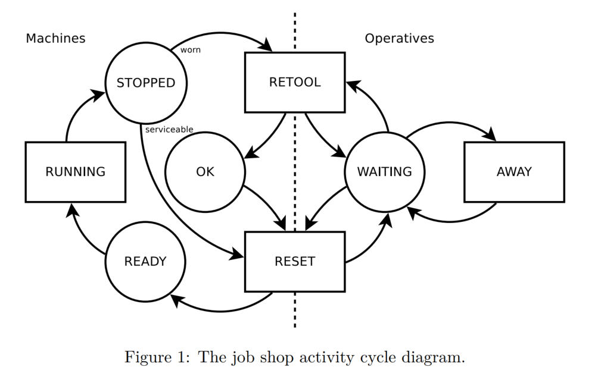

# Development Roadmap

## Next steps

consider `logCoreInteractions=false` as default 

**TODO** complete and publish hospital example

## v0.7

**{todo}** [#18](https://github.com/holgerbrandl/kalasim/issues/18) respect ticktrafo in built-in visualizations 

**{todo}** mandatory jsonable on sim-entities feels cumbersome

**{todo}** use standard sl4j for simulation logging or at least provide adapter

**{todo}** provide heatmap of component-list status --> and document it as 'built-in vis' in the corresponding section

**{todo}** storeRefs --> trackArrivals
* revisit storing/streaming of metrics (with time limit)
* memory profiling of hospital 

## v0.8

better work out https://www.kalasim.org/setup/ for novice users (e.g. use koans/or datalore share)

simple optimizing example

https://groups.google.com/g/salabim/c/iK6o7umeXKc/m/l3t59WbKBgAJ?utm_medium=email&utm_source=footer
---

**{todo}** finish elevator example with visualization

---
**TODO** pathfinding example

https://github.com/citiususc/hipster

https://www.baeldung.com/java-a-star-pathfinding

---

**TODO** add planning example from classical scheduling theory
parallel maschines --> solve with or tools or optaplanner

> Other relevant applications arise in the context of health-care, where, for example, patients have to be assigned to surgery rooms that must be
equipped by considering the type (i.e., the family) of surgery to
be performed. In such cases, the weight usually models a level of
urgency for the patient.

---
## Later

**{todo}** review simjulia <https://simjuliajl.readthedocs.io/en/stable/topical_guides/5_shared_resources.html#containers>

**{todo}** should we support a resource queue limit ` queue_size = Inf)` (as in simmer ucar209,p19)

**{todo}** Benchmark desim, salabim, simmer vs kalasim
* See Ucar2019  5.1 `Comparison with similar frameworks`

---
**{todo}** lambda builder for interrupt/resume

---

Slicing of monitors <https://www.salabim.org/manual/Monitor.html#slicing-of-monitors>

---

consider modeling `Store` Using Stores you can model the production and consumption of concrete objects as in <https://simpy.readthedocs.io/en/latest/topical_guides/resources.html#stores>

---

**{todo}** restrict more methods in Component from being overridden

---

fix <https://github.com/holgerbrandl/kravis/issues/25>

---

also adjust random generator of kotlin to prevent non-determinism entering simulation when user is doing `listOf().random()`

## More Examples

**{todo}** port interesting examples from <https://simjuliajl.readthedocs.io/en/stable/examples/index.html>

**{todo}** port other interesting simmer examples

**{todo}** port machine repair example from  <https://github.com/matloff/des>

**{todo}** port interesting SimPy examples from <https://simpy.readthedocs.io/en/latest/examples/index.html>

**{todo}** port  machine maintenance example from ucar 2019

