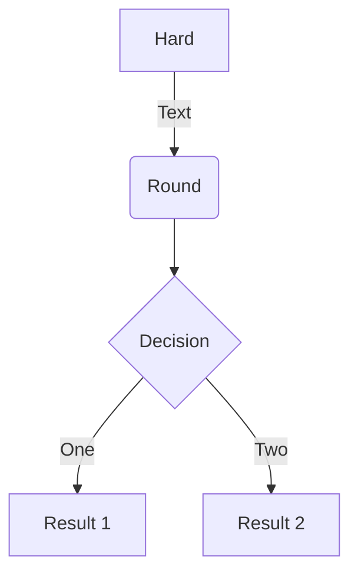
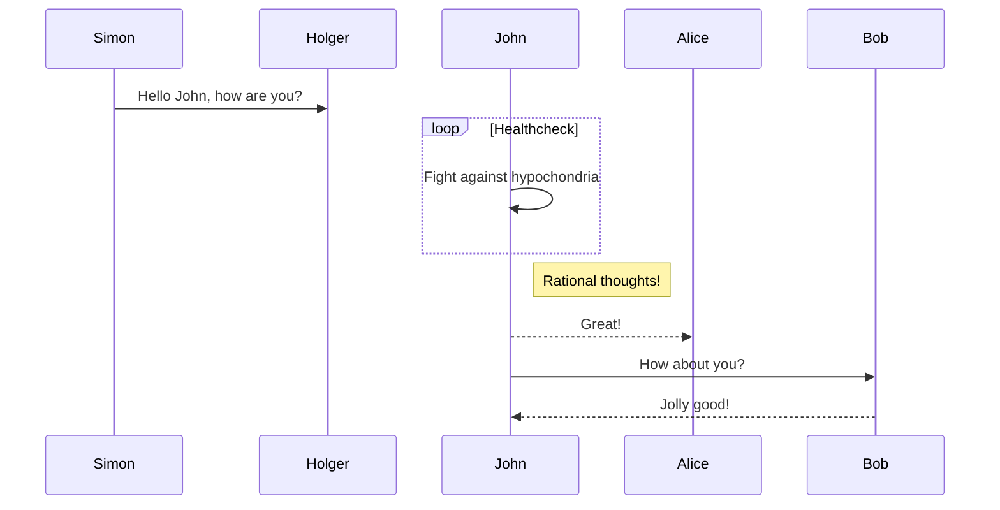

# About


## Tester2

`kalasim` is licensed under MIT License.


```json
{
  "jsonrpc" : "2.0",
  "id" : 51,
  "result" : {
    "startingBlock" : "0x5a0",
    "currentBlock" : "0xad9",
    "highestBlock" : "0xad9"
  }
}
```

```kotlin
import org.kalasim.*

data class Counter(var value: Int)

class Something(val counter: Counter): Component(){

    override suspend fun ProcContext.process() {
        counter.value++
    }
}
configureEnvironment {
    add { Counter(0)}
    add { Something(get())}
}.run(10)
```

```{.py3 hl_lines="1 3"}
# Python4 Program to convert temperature in celsius to fahrenheit

# change this value for a different result
celsius = 37.5

# calculate fahrenheit
fahrenheit = (celsius * 1.8) + 32
print('%0.1f degree Celsius is equal to %0.1f degree Fahrenheit' %(celsius,fahrenheit))
```



other mermaid

