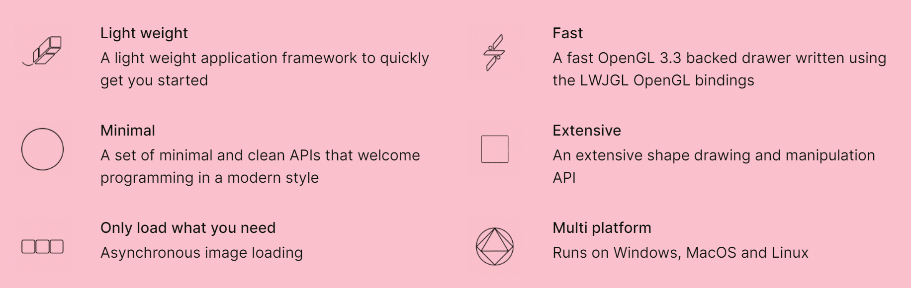

# Process Animation


[//]: # (https://www.salabim.org/manual/Animation.html)

Animation is a powerful tool to debug, test and demonstrate simulations.

It is possible use shapes (lines, rectangles, circles, etc), texts as well image to visualize the state of a simulation model. Statistical properties may be animated by showing the current value against the time.

Process animations can be

* [Synchronized](advanced.md#clock-synchronization) with the simulation clock and run in real time (synchronized)
* Advanced per simulation event (non-synchronized)


## How to get started?

All it takes is a single dependency

```kotlin
dependencies {
    api("com.github.holgerbrandl:kalasim-animation:0.7.97")
}
```

The dependency pull everything you need to animate simulations.

For fully worked out examples, have a look at the [lunar mining](animation/lunar_mining.md) or the [office tower](examples/office_tower.md).

If you're not sure how to configure gradle, you could also start with the provided processes animation [template project](https://github.com/holgerbrandl/kalasim/tree/master/simulations/hospital). 

## Under the hood

OPENRNDR is an open source framework for creative coding, written in Kotlin that simplifies writing real-time interactive software.


For more details see https://openrndr.org/

Process animation with `kalasim` is using `OPENRNDR` as backend and rendering engine. Animation is not part of the core API of kalasim, but support is provided by a decorator types (extending their respective base-type)

* `Component` -> `AnimationComponent`
* `Resource` -> `AnimationResource`
* `ComponentQueue` -> `AnimationResource`

These components are worked out below.

## Animation Template

The basic structure of a process animation is as follows

```kotlin
// {!./../../../../../../modules/animation/src/main/kotlin/org/kalasim/animation/AnimationTemplate.kt!}
```
Templates including gradle build files) sources can be found in the repo. F

For an in-depth walkthrough of the elements the an animation, see https://guide.openrndr.org/ 

## Animating Components

By changing the base class of a component from `Component` to `org.kalasim.animation.AnimationComponent`, we decorate the original with the following features

* Instances can have an initial position (modelled as `Point2D`)
* With `moveTo(newLocation:Point2D)` the API provides suspendable wrapper around [`hold()`](component.md#hold) 
* While being on hold, an animation can always request the current position with `c.currentPosition`. Positions are linearly interpolated.


## Animating `hold()` Interactions

An animation can track the status  [`hold()`](component.md#hold) interaction with `holdProgress`. It's a 2 step process

1. First, we need to register what type of holds we would like to monitor 
```kotlin
val UNLOADING = "Unloading"
val c: Component = Component()

c.registerHoldTracker(UNLOADING) { it.description.startsWith("unloading")}
```

2. Once it has been registered, the tracker can be consumed in the rendering loop with  `isHolding` and `holdProgress`.
```kotlin
if(c.isHolding(UNLOADING)) {
    drawer.contour(contour.sub(0.0, (1 - c.holdProgress(UNLOADING)!!)))
}
```

For a fully worked out example, see how the mining process is [animated](https://github.com/holgerbrandl/kalasim/blob/master/simulations/lunar-mining/src/main/kotlin/org/kalasim/demo/moon/LunarMiningHQ.kt#L31) in the  [lunar mining](animation/lunar_mining.md) demo.


## Animating Resources

Dedicated support for [resource](resource.md) rendering is coming soon. See [lunar mining](animation/lunar_mining.md) to see how it's done.  


## Animating States

Dedicated support for [state](state.md) rendering is coming soon.


## Animating Queues & Collections

Dedicated support for [collection](collections.md) rendering is coming soon.

[//]: # (**TODO** for queues consider point circles https://guide.openrndr.org/#/04_Drawing_basics/C05_ComplexShapes?id=shapes-and-contours-from-primitives)


## Other animation frontends

The animation support API does not bind to a particular rendering engine. However, until now only https://openrndr.org/ has been explored for process animation with `kalasim`.

