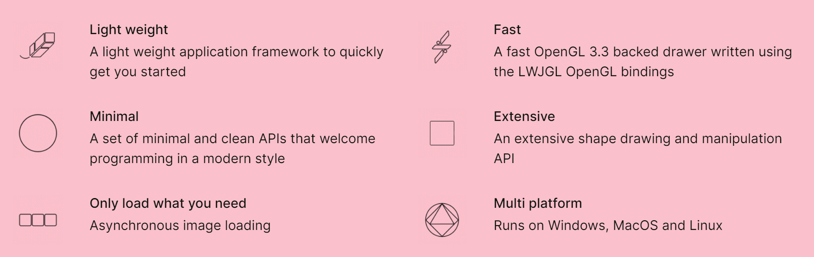

# Process Animation


[//]: # (https://www.salabim.org/manual/Animation.html)

Animation is a powerful tool to debug, test and demonstrate simulations.

It is possible use shapes (lines, rectangles, circles, etc), texts as well image to visualize the state of a simulation model. Statistical properties may be animated by showing the current value against the time.

Process animations can be

* [Synchronized](../advanced.md#clock-synchronization) with the simulation clock and run in real time (synchronized)
* Advanced per simulation event (non-synchronized)


## Building Process Animations with `openrndr`

OPENRNDR is an open source framework for creative coding, written in Kotlin that simplifies writing real-time interactive software.


For more details see https://openrndr.org/

Process animation with `kalasim` is using `openrendr` as backend and rendering engine. Animation is not part of the core API of kalasim, but support is provided by a decorator types (extending their respective base-type)

* `Component` -> `AnimationComponent`
* `Resource` -> `AnimationResource`
* `ComponentQueue` -> `AnimationResource`

These components are worked out below.

The basic structure of a process animation is as follows

```kotlin
// {!./../../../../../../modules/animation/src/main/kotlin/org/kalasim/animation/AnimationTemplate.kt!}
```
Templates including gradle build files) sources can be found in the repo. For instance have a look at the [lunar mining](lunar_mining.md) ([sources](../../../../simulations/lunar-mining)).


## Animating Components

By changing the base class of a component from `Component` to `org.kalasim.animation.AnimationComponent`, we decorate the original with the following features

* Instances can have an initial position (modelled as `Point2D`)
* With `moveTo(newLocation:Point2D)` the API provides suspendable wrapper around [`hold()`](../component.md#hold) 
* While being on hold, an animation can always request the current position with `c.currentPosition`. Positions are linearly interpolated.


The animation support API does not bind to a particular rendering engine. However, only https://openrndr.org/ has been explored for process animation with kalasim.

## Animating Resources

**TODO** 

[//]: # (**TODO** for queues consider point circles https://guide.openrndr.org/#/04_Drawing_basics/C05_ComplexShapes?id=shapes-and-contours-from-primitives)


## Animating Collections

**TODO** 

[//]: # (**TODO** for queues consider point circles https://guide.openrndr.org/#/04_Drawing_basics/C05_ComplexShapes?id=shapes-and-contours-from-primitives)
