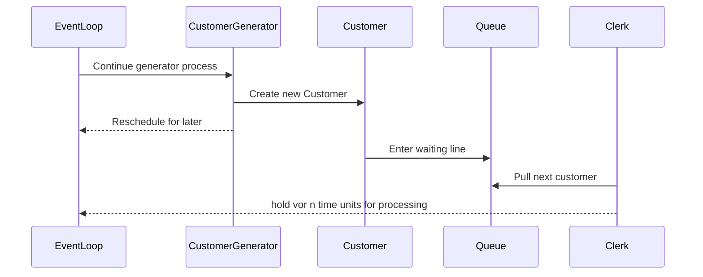

# Collections

A very common element of discrete simulation models, are queues of elements that are consumed by downstream components. A basic example would be the [waiting line in a bank](examples/bank_office.md#simple-bank-office-1-clerk).

Clearly, the JVM and Kotlin provide a very rich collection API ecosystem. However, `kalasim` is providing its own implementations for `List` and `Queue` with `ComponentList` and `ComponentQueue` respectively, that are backed with standard implementation but add additional metrics and tracking to allow statistical analysis. If such functionality is not needed in a particular simulation model, standard collection implementation can be used as well without any restriction.  


## Queue

`kalasim` provides an instrumented queue implementation `ComponentQueue` on top of the JVM's [PriorityQueue](https://docs.oracle.com/javase/7/docs/api/java/util/PriorityQueue.html)  to model waiting lines etc. Conceptual our implementation is very similar to `salabim`'s [queue](
https://www.salabim.org/manual/Queue.html).

A typical use case would be a generator process (material, customers, etc.) that is consumed by other components. By definition, a *generator* is a `Component` that contains at least one yield in its process definition.
In the following example a generator is creating new `Customer`s which are entering a waiting line `Queue`. This queue is consumed by a clerk which take one customer at a time and goes on [`hold`](#hold) for processing. See [here](https://github.com/holgerbrandl/kalasim/blob/master/src/test/kotlin/org/kalasim/examples/bank/oneclerk/Bank1clerk.kt) for the complete implementation.


Examples

* [ATM Queue](examples/atm_queue.md)


### Comparator

By default, the `ComponentQueue` is sorted by priority and enter-time. To provide a custom ordering scheme, the user can supply her own comparator easily

```kotlin
val cq = ComponentQueue(comparator = compareBy<Patient> { it.severity })

// or using a chained comparator
val cq2 = ComponentQueue(comparator = compareBy <Patient>{ it.severity }.thenBy { it.type })
```

### Batching

Queues can be consumed in a *batched* manner using the `batch()`. See ["The Ferryman"](examples/ferryman.md) for a worked out example and its API documentation.


## List

As alternative to the ordered queue, `kalasim` also provides a similarly instrumented list implementation with `ComponentList`. It's only providing very basic FiFo queue characteristics with `poll()` supported by its backend. 

The main intent for `ComponentList` are more sophisticated use-cases that can not be modelled with a single queue. Examples are 

* Machine scheduling with more than instance
* Service models with different

In such cases, a simple `Comparator` (even a chained one) are often insufficient to model the complex scheduling requirements.


## Metrics

Both, the `ComponentList` and the `ComponentQueue` provide a similar set of built-in metrics


Monitors

* `queueLengthMonitor` tracks the queue length level across time
* `lengthOfStayMonitor` tracks the length of stay in the queue over time


Statistics

* `stats` - Current state snapshot of queue statistics regarding length and length of stay
* `info` - Json-structured summary of the list/queue


## Capacity

Collections support a `capacity` and an accompanying `capacityTimeline` to set a maximum capacity. If this capacity is exceeded a `CapacityExceededException` is being thrown. 

A capacity can be reduced (similar to [resources](resource.md)) by setting a new one
```asciidoc
val queue = ComponentQueue(capacity=5)
queue.capacity = 10
```

When setting a capacity that is lower than the current collection size, a `CapacityExceededException` is being thrown. 