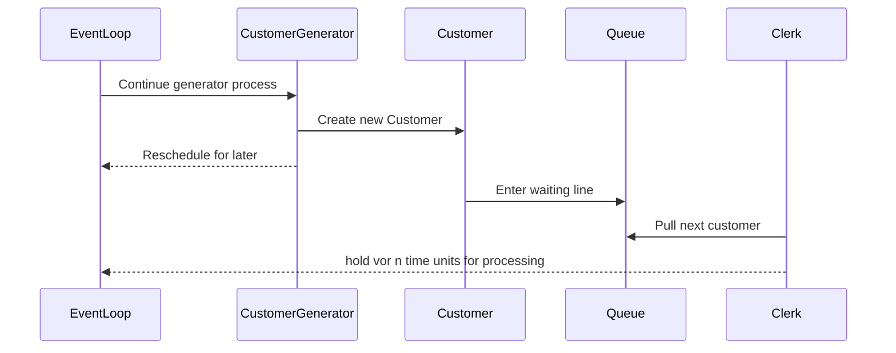

# Component

Components are the key elements of a simulation.

Components can be either  in *data* or an *active* [lifecycle](#lifecycle) state. An *active*  component has one or more *process*  descriptions and is activated at some point of time. We can [transition](#process-interaction) a *data*  component to *active* with [`activate()`](#activate). An *active* component can become `DATA` either with a [`cancel()`](#cancel) or by reaching the end of a process method.

It is easy to create a data component by:

```kotlin
val component = Component()
```

*Data*  components may be placed in a queue. This component will not be activated as there is no associated process method.

In order to make an *active*  component it is necessary to first define a class. There has to be at least one sequence generator method, normally called `process`:


```
class Ship: Component(){
    override fun process() = sequence {
        ...
        yield(...)
        ...
    }
}
```


Normally, the process will contain at least one [`yield`](https://kotlinlang.org/api/latest/jvm/stdlib/kotlin.sequences/-sequence-scope/yield.html) statement. But that's not a requirement.


Typically, the user must not use `yield` directly, but rather the provided [process interaction](#process-interaction) methods.

Creation and activation can be combined by making a new instance of the class:

```kotlin
val ship1 = Ship()
val ship2 = Ship()
val ship3 = Ship()
```

This causes three Ships to be created and to start them at Sim.process().
The ships will be named automatically `Ship.0` unless a name
is provided.

If no process method is found for `Ship`, the ship will be a data component.
In that case, it may become active by means of an `activate()` statement:

```kotlin
//{!CraneProcess.kts!}
```

Effectively, creation and start of `crane1` and `crane2` is the same.

In most practical scenarios, the `process` parameter is omitted in the method signature.

Although not very common, it is possible to activate a component at a certain time or with a specified delay:

```kotlin
ship1.activate(at=100)
ship2.activate(delay=50)
```

<!--TODO consider if we should use the notion of a trajectory as done in simmer-->

## Creation of a component

Although it is possible to create a component directly with `val x = Component()`, this
makes it very hard to make that component into an active component, because there's no process method. So, nearly always we define our simulation entities by extending `org.kalasim.Component`:

```kotlin
class Car: Component(){
    override fun process() = sequence {
        hold(1) // or whatever
    }
}
```

If we then say `val car = Car()`, a component is created, and it activated from process. This process is nearly always, but not necessarily a *generator method*  (i.e. it has at least one `yield` statement).

The result is that car is put on the future [event list](basics.md#event-queue) (for time `now`) and when it's its turn, the component becomes `CURRENT`.

It is also possible to set a time at which the component (car) becomes active, like `val car = Car(at=10)`. This requires an additional constructor argument to be passed on to `Component` as in `class Car(at:Number): Component(delay=at)`.

And instead of starting at process, the component may be initialized to start at another (generator) method,
like `car=Car(process=Car::wash)`.

And, finally, if there is a process method, you can disable the automatic activation (i.e. make it a data component), by specifying `process = null`.

If there is no process method, and process= is not given, the component will be a data component.


## Lifecycle

A component is always in one of the following states modelled by `org.kalasim.ComponentState`:

* `CURRENT` - The component's process is currently being executed by the [event queue](basics.md#event-queue)
* `SCHEDULED` - The component is [scheduled](basics.md#event-queue) for future execution
* `PASSIVE` - The component is idle
* `REQUESTING` - The component is waiting for a [resource](resource.md) requirement to be met
* `WAITING` - The component is [waiting](#wait) for a [state](state.md) predicate to be met
* `STANDBY` - The component was put on [standby](#standby)
* `INTERRUPTED` - The component was [interrupted](#interrupt)
* `DATA` - The component is non of the _active_ states above. Components without a `process` definition are always in this state.


A component's status is automatically tracked in the status level monitor `component.statusMonitor`. Thus, it possible to check how long a component has been in passive state with

```kotlin
val passive_duration = component.statusMonitor[ComponentState.PASSIVE]
```

It is possible to print a histogram with all the statuses a component has been in with

```kotlin
component.statusMonitor.printHistogram()
```

## Process Interaction

The scheme below shows how interaction relate to component state transitions:

|   from/to   |     data     |           current           |      scheduled       |      passive       |      requesting      |       waiting        |      standby       |      interrupted      |
|:-----------:|:------------:|:---------------------------:|:--------------------:|:------------------:|:--------------------:|:--------------------:|:------------------:|:---------------------:|
|    data     |              | activate<sup>[1](#f1)</sup> |       activate       |                    |                      |                      |                    |                       |
|   current   | process end  |                             |      yield hold      |  yield passivate   |    yield request     |      yield wait      |   yield standby    |                       |
|      .      | yield cancel |                             |    yield activate    |                    |                      |                      |                    |                       |
|  scheduled  |    cancel    |         next event          |         hold         |     passivate      |       request        |         wait         |      standby       |       interrupt       |
|      .      |              |                             |       activate       |                    |                      |                      |                    |                       |
|   passive   |    cancel    |    activate<sup>1</sup>     |       activate       |                    |       request        |         wait         |      standby       |       interrupt       |
|      .      |              |                             |   hold<sup>2</sup>   |                    |                      |                      |                    |                       |
| requesting  |    cancel    |         claim honor         | activate<sup>3</sup> |     passivate      |       request        |         wait         |      standby       |       interrupt       |
|      .      |              |          time out           |                      |                    | activate<sup>4</sup> |                      |                    |                       |
|   waiting   |    cancel    |         wait honor          | activate<sup>5</sup> |     passivate      |         wait         |         wait         |      standby       |       interrupt       |
|      .      |              |           timeout           |                      |                    |                      | activate<sup>6</sup> |                    |                       |
|   standby   |    cancel    |         next event          |       activate       |     passivate      |       request        |         wait         |                    |       interrupt       |
| interrupted |    cancel    |                             |  resume<sup>7</sup>  | resume<sup>7</sup> |  resume<sup>7</sup>  |  resume<sup>7</sup>  | resume<sup>7</sup> | interrupt<sup>8</sup> |
|      .      |              |                             |       activate       |     passivate      |       request        |         wait         |      standby       |                       |

<!--https://stackoverflow.com/questions/25579868/how-to-add-footnotes-to-github-flavoured-markdown-->

<!-- to enable achnor link parsing in markdown navigator enable "inline html a tag" -->

1. <a id="f1"></a> Via `scheduled()`
1. <a id="f2"></a> Not recommended
1. <a id="f3"></a> With `keepRequest = false` (default)
1. <a id="f4"></a> With `keepRequest = true`. This allows to set a new time out
1. <a id="f5"></a> With `keepWait = false` (default)
1. <a id="f6"></a> With `keepWait = true`. This allows to set a new timeout
1. <a id="f7"></a> State at time of interrupt
1. <a id="f8"></a> Increases the `interruptLevel`


### activate

Activate is the way to turn a data component into a live component. If you do not specify a process,
the (usually generator) function process is assumed. So you can say:

```kotlin
val car0 = Car(process=null)  // data component
car0.activate()  // activate @ process if exists, otherwise error

val car1 = Car(process=null)  // data component
car1.activate(process=null) //  activate @ wash
```

* If the component to be activated is current, always use `yield(activate())`. The effect is that the
  component becomes scheduled, thus this is essentially equivalent to the preferred hold method.
* If the component to be activated is passive, the component will be activated at the specified time.
* If the component to be activated is scheduled, the component will get a new scheduled time.
* If the component to be activated is requesting, the request will be
  terminated, the attribute failed set and the component will become scheduled. If keep_request=True
  is specified, only the fail_at will be updated and the component will stay requesting.
* If the component to be activated is waiting, the wait will be
  terminated, the attribute failed set and the component will become scheduled. If keep_wait=True
  is specified, only the fail_at will be updated and the component will stay waiting.
* If the component to be activated is standby, the component will get a new scheduled time and become
  scheduled.
* If the component is interrupted, the component will be activated at the specified time.

### hold

Hold is the way to make a - usually `current` - component `scheduled`.


* If the component is `CURRENT`, it will suspend execution internally, and the component becomes scheduled for the specified time
* If the component to be held is passive, the component becomes scheduled for the specified time.
* If the component to be held is scheduled, the component will be rescheduled for the specified time, thus
  essentially the same as activate.
* If the component to be held is standby, the component becomes scheduled for the specified time.
* If the component to be activated is requesting, the request will be terminated, the attribute failed
  set and the component will become scheduled. It is recommended to use the more versatile activate method.
* If the component to be activated is waiting, the wait will be
  terminated, the attribute failed set and the component will become scheduled. It is recommended to
  use the more versatile activate method.
* If the component is interrupted, the component will be activated at the specified time.

### passivate

Passivate is the way to make a - usually `current` - component `passive`. This is essentially the
same as scheduling for time=inf.
<!--TODO rework time=inf-->

* If the component to be passivated is `CURRENT`, the component becomes passive, and it will suspend execution internally.
* If the component to be passivated is `passive`, the component remains `passive`.
* If the component to be passivated is `scheduled`, the component becomes `passive`.
* If the component to be held is `standby`, the component becomes `passive`.
* If the component to be activated is requesting, the request will be terminated, the attribute failed
  set and the component becomes passive. It is recommended to use the more versatile activate method.
* If the component to be activated is waiting, the wait will be
  terminated, the attribute failed set and the component becomes passive. It is recommended to
  use the more versatile activate method.
* If the component is interrupted, the component becomes passive.

### cancel

Cancel has the effect that the component becomes a data component.

* If the component to be cancelled is `CURRENT`, it will suspend execution internally.
* If the component to be cancelled is `passive`, scheduled, interrupted  or standby, the component
  becomes a data component.
* If the component to be cancelled is `requesting`, the request will be terminated, the attribute failed
  set, and the component becomes a data component.
* If the component to be cancelled is waiting, the wait will be terminated, the attribute failed
  set and the component becomes a data component.

### standby

Standby has the effect that the component will be triggered on the next simulation event.

* If the component is `CURRENT`, it will suspend execution internally.
* Although theoretically possible, it is not recommended to use standby for non current components.

Examples

* [Bank Office with Standby](examples/bank_office.md#bank-office-with-standby)


### request

Request has the effect that the component will check whether the requested quantity from a resource is available. It is possible to check for multiple availability of a certain quantity from several resources.

Instead of checking for all of number of resources, it is also possible to check for any of a number of resources, by setting the `oneOf` parameter to `true`.

By default, there is no limit on the time to wait for the resource(s) to become available. However, it is possible to set a time with `failAt` at which the condition has to be met. If that failed, the component becomes `CURRENT` at the given point of time. This is also known as *reneging*.
<!--The code should then check whether the request had failed. That can be checked with the `Component.failed` property.-->

If the component is canceled, activated, passivated, interrupted or held the `failed` flag will be set as well.

* If the component is `CURRENT`, it will suspend execution internally
* Although theoretically possible it is not recommended to use request for non current components.

<!-- TODO describe better what happens if request is rejected or fails to be fulfilled-->

<!--TBD support simmer::renege_if?-->

A component can also actively renege a pending request by calling `release(resource)`. See `Bank3ClerksRenegingResources` for an example (as well as `Bank3ClerksReneging` `Bank3ClerksRenegingState` for other supported reneging modes).

### wait

Wait has the effect that the component will check whether the value of a state meets a given condition. It is possible to check for multiple states. By default, there is no limit on the time to wait for the condition(s) to be met. However, it is possible to set a time with `failAt` at which the condition has to be met. If that failed, the component becomes `CURRENT` at the given point of time. The code should then check whether the wait had failed. That can be checked with the `Component.failed` property.

If the component is [canceled](#cancel), [activated](#activate), [passivated](#passivate), [interrupted](#interrupt) or [held](#hold) the failed flag will be set as well.

* If the component is `CURRENT`, it will suspend execution internally
* Although theoretically possible it is not recommended to use wait for non current components.

### interrupt

With interrupt components that are not current or data can be temporarily be interrupted. Once a resume is called for the component, the component will continue (for scheduled with the remaining time, for waiting or requesting possibly with the remaining fail_at duration).

Examples

* [Machine Parts](examples/machine_parts.md)

## Usage of process interaction methods within a function or method

There is a way to put process interaction statement in another function or method.
This requires a slightly different way than just calling the method.

As an example, let's assume that we want a method that holds a component for a number of minutes and that the time unit is actually seconds.
So we need a method to wait 60 times the given parameter.

We start with a not so elegant solution:

```kotlin
object : Component() {
    override fun process() = sequence<Component>{
        hold(5.0)
        hold(5.0)
    }
}
```

Now we just add a method `holdMinutes`. Direct calling `holdMinutes` is not possible. Instead, we have to define an extension function on `SequenceScope<Component>`:

```kotlin
object : Component() {
    override fun process() = sequence {
        holdMinutes()
        holdMinutes()
    }

    private suspend fun SequenceScope<Component>.holdMinutes() {
        hold(5.0)
    }
}
```

All process interaction statements including `passivate`, `request` and `wait` can be used that way!

So remember if the method contains a `yield` statement (technically speaking iss a generator method), it should be called with from an extension function.

## Component Generator

Since creation/generation of components is a very common element of most simulations, there is a dedicated utility called `ComponentGenerator` to do so

```kotlin
ComponentGenerator(iat = exponential(lambda, rg)) {
    Customer()
}
```

It requires 2 main parameters
1. a builder pattern
2. an inter-arrival distribution

See [here](https://github.com/holgerbrandl/kalasim/blob/master/src/main/kotlin/org/kalasim/ComponentGenerator.kt#L20) for a complete listing of supported arguments.


Examples

* [Car Wash](examples/car_wash.md)
* [Gas Station](examples/gas_station.md)
* [ATM Queue](examples/atm_queue.md)


## Queue

Kalasim builds on top of the JVM's [PriorityQueue](https://docs.oracle.com/javase/7/docs/api/java/util/PriorityQueue.html)  to model waiting lines etc. Conceptual our implementation is very similar to `salabim`'s [queue](
https://www.salabim.org/manual/Queue.html).


A typical use case would be a generator process (material, customers, etc.) that is consumed by other components. By definition, a *generator* is a `Component` that contains at least one yield in its process definition.
 In the following example a generator is creating new `Customer`s which are entering a waiting line `Queue`. This queue is consumed by a clerk which take one customer at a time and goes on [`hold`](#hold) for processing. See [here](https://github.com/holgerbrandl/kalasim/blob/master/src/test/kotlin/org/kalasim/examples/bank/oneclerk/Bank1clerk.kt) for the complete implementation.




Examples

* [ATM Queue](examples/atm_queue.md)
