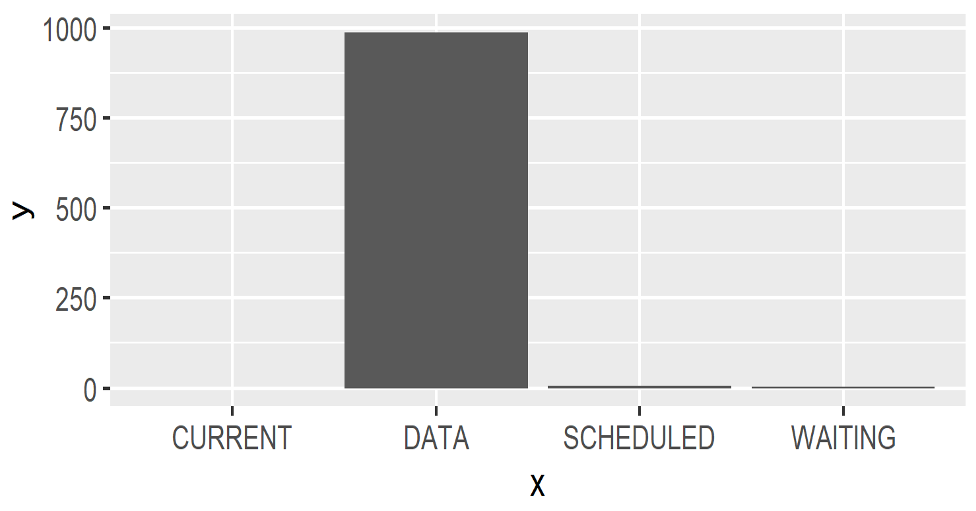

# Component

Components are the key elements of a simulation. By providing a [process definition](#process-definition) of the business process in study, components allow modeling the interplay with other simulation components as well as its timing.

Components can be in different [lifecycle](#lifecycle) state. An `ACTIVE`  component has one or more [process definitions](#process-definition) of which one was activated at some point earlier in time. 

If a component has an associated process definition, we can schedule it for execution using  [`activate()`](#activate). This will also change its state to become active `ACTIVE`, 

An `ACTIVE` component can become `DATA` either with a [`cancel()`](#cancel) or by reaching the end of its [process definition](#process-definition).

It is very easy to create a `DATA` components which can be useful to model more passive elements in a model (such as production material).

```kotlin
val component = Component()
```

Components will interact with each other through a well-defined vocabulary of [process interaction](#process-interaction) methods.

!!!info
    By default, Components will be named automatically, using the pattern `[Class Name].[Instance Number]` unless a custom name is provided via the `name` parameter in `Component(name="Foo")`. Kalasim also supports _auto-indexing_ if a provided component name ends with a dash `-`, dot `.` or underscore `_`. E.g. A first `Component("Foo-")` will be named `Foo-1`, a second one `Foo-2` and so on.

## Process Definition

Although it is possible to create a component directly with `val x = Component()`, this does not encode any simulation mechanics a there is process definition defining how the `x` will interact with the simulation environment. So, nearly always we define our simulation entities by extending `Component` and by providing a _process definition_ which details out the component's life cycle:

!!!important
    The process definition of a component defines its dynamics and interplay with other simulation entities. Writing down the process definition is the **key** modelling task when using `kalasim`.

If there is no process definition, a component will stay passive. Techncially, it is refrerred to as a [`DATA`](#lifecycle) component.

There are 3 supported methods to provide a process definition.

### 1. Extend `process`

Let's start with the most common method. In order to define an `ACTIVE`  component it is necessary to extend `org.kalasim.Component` to provide (at least) one sequence generator method, normally called `process`:

```kotlin
class Car: Component(){
    override fun process() = sequence {
        wait(customerArrived)
      
        request(driver){
            hold(4, "driving")
        }
    }
}
```

If we then later say `val car = Car()`, a component is created, and it is scheduled for execution within kalasim's [event loop](basics.md#event-queue). The `process` method is nearly always, but not necessarily a *generator method*  (i.e. it has at least one `yield` statement), so it contains suspension points where execution can be stalled. 

It is also possible to set a time at which the component (`car`) becomes active, like `val car = Car(delay=10)`. This requires an additional constructor argument to be passed on to `Component` as in `class Car(delay:Number): Component(delay=delay)`.


Creation and activation are by default combined when creating a new `Component` instance:

```kotlin
val car1 = Car()
val car2 = Car()
val car3 = Car()
```

This causes three cars to be created and to be [activated](component.md#activate), so these instances are _scheduled_ for execution in the simulation's [event queue](basics.md#event-queue).


!!!info
In some situations, automatic activation of the process definition may not be needed or desired. If so, even in presence of a `process` or `repeatedProcess` method, you can disable the automatic activation (i.e. make it a data component), by specifying `Component(process = Component::none)`.


Normally, any process definition will contain at least one [`yield`](https://kotlinlang.org/api/latest/jvm/stdlib/kotlin.sequences/-sequence-scope/yield.html) statement. By doing so, the component can hand-back control to the simulation engine at defined points when a component needs to wait. Typically, the user must not use `yield` directly, but rather the provided [process interaction](#process-interaction) methods.


### 2. Extend `repeatedProcess`

Another very common pattern when writing down process definitions, iteratively executed processes. This could be modelled directly as described above using [`process`](#1-extend-process). But as shown in the following example, this lacks somewhat lacks conciseness: 

```kotlin
class Machine : Component(){
    override fun process() = sequence {
        while(true) {
          wait(hasMaterial)
          hold(7, "drilling")
        }
    }
}
```

Luckily, this can be expressed more elegantly with `repeatedProcess`:

```kotlin
class Machine : Component(){
    override fun repeatedProcess() = sequence {
        wait(hasMaterial)
        hold(7, "drilling")
    }
}
```

### 3. Process Reference

A component may be initialized to start at another process definition method. This is achieved by passing a reference to this method which must be part of the component's class definition, like `val car = Car(process = Car::wash)`.

It is also possible to prepare multiple process definition, which may become active later by means of an `activate()` statement:

```kotlin
//{!api/CraneProcess.kts!}
```

Effectively, creation and start of `crane1` and `crane2` is the same.

### Inlining Subprocesses

To run/consume/inline another [process definition](#process-definition), we can use[`yieldAll(subProcess())`](https://kotlinlang.org/api/latest/jvm/stdlib/kotlin.sequences/-sequence-scope/yield-all.html) to inline `subProcess()` defined for the same component. This allows to inline the entire process definition in a blocking manner. Here's an example how to do so:

```kotlin
//{!api/ConsumeSubProcess.kts!}
```

### Toggling processes

It's a very effective tool in discrete simulation, to toggle the process definition of a component at runtime. Using [`activate()`](#activate) we can toggle processes very effectively in a simulation model. There are 3 ways to do so

1. From with a component's [process defintion](#process-definition)
2. Within another component process defintion
3. Outside of any process definition.

The following example illustrates these examples as well as [process inlining](#inlining-subprocesses):

```kotlin
//{!api/Restaurant.kts!}
```
Notably, we can provide process arguments here in a typesafe manner.


## Lifecycle

A simulation component is always in one of the following states modelled by `org.kalasim.ComponentState`:

* `CURRENT` - The component's process is currently being executed by the [event queue](basics.md#event-queue)
* `SCHEDULED` - The component is [scheduled](basics.md#event-queue) for future execution
* `PASSIVE` - The component is idle
* `REQUESTING` - The component is waiting for a [resource](resource.md) requirement to be met
* `WAITING` - The component is [waiting](#wait) for a [state](state.md) predicate to be met
* `STANDBY` - The component was put on [standby](#standby)
* `INTERRUPTED` - The component was [interrupted](#interrupt)
* `DATA` - The component is non of the _active_ states above. Components without a `process` definition are always in this state.


A component's status is managed via the property `component.componentState`, and is automatically tracked with a [level monitor](monitors.md#level-monitor) named `component.statusTimeline`.


The `statusMonitor` can be consumed in different ways. It possible to check how long a component has been in a particular state with

```kotlin
val passiveDuration = component.statusMonitor[ComponentState.PASSIVE]
```
Also, it is possible to print a histogram with all the statuses a component has been in with

```kotlin
component.statusMonitor.printHistogram()
```

Accumulated times in a particular state can be obtained with `summed()` and be printed to console or displayed with the selected graphics backend

```kotlin
val timeInEachState = component.statusMonitor.summed()

timeInEachState.printConsole()
timeInEachState.display()
```



## Process Interaction

The scheme below shows how interaction relate to component state transitions:

|   from/to   |     data     |           current           |      scheduled       |      passive       |      requesting      |       waiting        |      standby       |      interrupted      |
|:-----------:|:------------:|:---------------------------:|:--------------------:|:------------------:|:--------------------:|:--------------------:|:------------------:|:---------------------:|
|    data     |              | activate<sup>[1](#f1)</sup> |       activate       |                    |                      |                      |                    |                       |
|   current   | process end  |                             |      yield hold      |  yield passivate   |    yield request     |      yield wait      |   yield standby    |                       |
|      .      | yield cancel |                             |    yield activate    |                    |                      |                      |                    |                       |
|  scheduled  |    cancel    |         next event          |         hold         |     passivate      |       request        |         wait         |      standby       |       interrupt       |
|      .      |              |                             |       activate       |                    |                      |                      |                    |                       |
|   passive   |    cancel    |    activate<sup>1</sup>     |       activate       |                    |       request        |         wait         |      standby       |       interrupt       |
|      .      |              |                             |   hold<sup>2</sup>   |                    |                      |                      |                    |                       |
| requesting  |    cancel    |         claim honor         | activate<sup>3</sup> |     passivate      |       request        |         wait         |      standby       |       interrupt       |
|      .      |              |          time out           |                      |                    | activate<sup>4</sup> |                      |                    |                       |
|   waiting   |    cancel    |         wait honor          | activate<sup>5</sup> |     passivate      |         wait         |         wait         |      standby       |       interrupt       |
|      .      |              |           timeout           |                      |                    |                      | activate<sup>6</sup> |                    |                       |
|   standby   |    cancel    |         next event          |       activate       |     passivate      |       request        |         wait         |                    |       interrupt       |
| interrupted |    cancel    |                             |  resume<sup>7</sup>  | resume<sup>7</sup> |  resume<sup>7</sup>  |  resume<sup>7</sup>  | resume<sup>7</sup> | interrupt<sup>8</sup> |
|      .      |              |                             |       activate       |     passivate      |       request        |         wait         |      standby       |                       |

<!--https://stackoverflow.com/questions/25579868/how-to-add-footnotes-to-github-flavoured-markdown-->

<!-- to enable achnor link parsing in markdown navigator enable "inline html a tag" -->

1. <a id="f1"></a> Via `scheduled()`
1. <a id="f2"></a> Not recommended
1. <a id="f3"></a> With `keepRequest = false` (default)
1. <a id="f4"></a> With `keepRequest = true`. This allows to set a new time out
1. <a id="f5"></a> With `keepWait = false` (default)
1. <a id="f6"></a> With `keepWait = true`. This allows to set a new timeout
1. <a id="f7"></a> State at time of interrupt
1. <a id="f8"></a> Increases the `interruptLevel`


### hold

This method is utilized to suspend a component for a specific duration of simulation time. It changes that the state of a - usually `current` - component to `scheduled`. By invoking the hold method, control is returned from the process definition back to the simulation engine.
After the specified hold duration, the engine will resume the execution of the process definition. This becomes a crucial method in `kalasim`, as it dictates the temporal flow of the overall process.

Here's a basic example illustrating this process:

```kotlin
object : Component("Something") {
    override fun process() = sequence {
        hold(10.minutes, description = "some action")
        // ^^ This is telling kalasim to suspend execution of this process 
        // for 10 simulation minutes

        // ... 10 minutes later ...
        // After these 10 minutes, it will continue execution of the process
        hold(1.minutes, description = "some other action ")
    }
}
```

Supported parameters in `hold()` are

* `duration` - The duration for which the component should be held.
* `description` - An optional description for the hold operation.
* `until` - The simulation time until which the component should be held. If provided, the component will be held until the specified simulation time.
* `priority` - The priority of the hold operation. A higher priority value indicates a higher priority. Defaults to `NORMAL`.
* `urgent` - A flag indicating whether the hold operation is urgent. If set to true, the component will be scheduled with the highest possible priority. Defaults to `false`.

Either `duration` or `until` must be specified when calling `hold()` to indicate the intended delay.


#### State Contract

The [state](#lifecycle) contract when calling `hold()` is as follows

* If the component is `CURRENT`, it will suspend execution internally, and the component becomes scheduled for the specified time
* If the component to be held is passive, the component becomes scheduled for the specified time.
* If the component to be held is scheduled, the component will be rescheduled for the specified time, thus
  essentially the same as activate.
* If the component to be held is standby, the component becomes scheduled for the specified time.
* If the component to be activated is requesting, the request will be terminated, the attribute failed
  set and the component will become scheduled. It is recommended to use the more versatile activate method.
* If the component to be activated is waiting, the wait will be
  terminated, the attribute failed set and the component will become scheduled. It is recommended to
  use the more versatile activate method.
* If the component is interrupted, the component will be activated at the specified time.


### activate

`activate()` will schedule execution of a [process definition](#process-definition) at the specified time. If no time is specified, execution will be scheduled for the current simulation time. If you do not specify a process, the current process will be scheduled for *continuation*. If a `process` argument is provided, the process will be *started* (or *restarted* if it is equal to the currently active process).

```kotlin
Car() // default to process=Component::process or Component::repeatedProcess   
Car(process=Component::none) // no process, which effectivly makes the car DATA     

val car = Car(process=Car::driving) // start car in driving mode  

// stop driving (if still ongoing) and activate refilling process
car1.activate(process=Car::refilling)

// activate defined process if set, otherwise error
car0.activate()  
```

#### Parameters

Supported parameters in `activate()`

* `process` - The name of the process to be started. If set to `None`, the process will not be changed. If the component is a data component, the generator function `process` will be used as the default process. Optionally type safe arguments can be provided to the generator function  via `processArgument` and `otherProcessArgument`
* `processArgument` - The argument to be passed to the process.
* `at` - The schedule time. If omitted, no `delay` is used.
* `delay` - The delay before starting the process. It uses a `Duration` object to specify the delay amount. The default value is `Duration.ZERO`.
* `priority` - The priority level of the activation. It uses the `Priority` enumeration with options HIGH, NORMAL, and LOW. The default value is NORMAL.
* `urgent` - Indicates whether the activation is urgent or not. If set to true, the activation will be treated as urgent. The default value is false.
* `keepRequest` - Indicates whether to keep the activation request even after the process is started. If set to true, the activation request will be kept. The default value is false.
* `keepWait` - Indicates whether to keep waiting for the process to complete before returning. If set to true, the activation will not return until the process is complete. The default value is false.
#### State Contract

The [state](#lifecycle) contract when calling `hold()` is as follows

<!--* If the component to be activated is `CURRENT`, always use `yield(activate())`. The effect is that the-->
<!--  component becomes scheduled, thus this is essentially equivalent to the preferred hold method.-->
* If the component to be activated is `DATA`, unless provided with `process` the default `Component::process` will be scheduled at the specified time.
* If the component to be activated is `PASSIVE`, the component will be activated at the specified time.
* If the component to be activated is `SCHEDULED`, the component will get a new scheduled time.
* If the component to be activated is `REQUESTING`, the request will be
  terminated, the attribute failed set, and the component will become scheduled. If keep_request=True
  is specified, only the fail_at will be updated, and the component will stay requesting.
* If the component to be activated is `WAITING`, the wait will be
  terminated, the attribute `failed` set, and the component will become scheduled. If `keepWait=true`
  is specified, only the `failAt` will be updated, and the component will stay waiting.
* If the component to be activated is `STANDBY`, the component will get a new scheduled time and become
  scheduled.
* If the component is `INTERRUPTED`, the component will be activated at the specified time.

#### Misc

!!!important
    It is not possible to `activate()` the `CURRENT` component without providing a `process` argument. `kalasim` will throw an error in this situation. The effect of a "self"-activate would be that the component becomes scheduled, thus this is essentially equivalent to the preferred hold method, so please use `hold` instead. The error is a safe-guard mechanism to prevent the user from unintentionally rescheduling the current component again. 


In situations where the current process need to be restarted, we can use activate `yield(activate(process = Component::process))` which will bypass the internal requirement that the activated component must not be `CURRENT`.


Although not very common, it is also possible to activate a component at a certain time or with a specified delay:

```kotlin
ship1.activate(at=100)
ship2.activate(delay=50.minutes)
```

!!!note
    It is possible to use `activate()` outside of a process definition, e.g. to toggle processes after some time  

    ```kotlin
    sim.run(10)
    car.activate(process=Car::repair)
    sim.run(10)
    ```
    However, in most situations this is better modelled within a [process definition](#process-definition).

We can use `activate`  to [toggle](#toggling-processes) the active process of a component

### passivate

Passivate is the way to make a - usually `current` - component `passive`. This is essentially the
same as scheduling for time=inf.
<!--TODO rework time=inf-->

* If the component to be passivated is `CURRENT`, the component becomes passive, and it will suspend execution internally.
* If the component to be passivated is `passive`, the component remains `passive`.
* If the component to be passivated is `scheduled`, the component becomes `passive`.
* If the component to be held is `standby`, the component becomes `passive`.
* If the component to be activated is requesting, the request will be terminated, the attribute failed
  set and the component becomes passive. It is recommended to use the more versatile activate method.
* If the component to be activated is waiting, the wait will be
  terminated, the attribute failed set and the component becomes passive. It is recommended to
  use the more versatile activate method.
* If the component is interrupted, the component becomes passive.

### cancel

Cancel has the effect that the component becomes a data component.

* If the component to be cancelled is `CURRENT`, it will suspend execution internally.
* If the component to be cancelled is `passive`, scheduled, interrupted  or standby, the component
  becomes a data component.
* If the component to be cancelled is `requesting`, the request will be terminated, the attribute failed
  set, and the component becomes a data component.
* If the component to be cancelled is waiting, the wait will be terminated, the attribute failed
  set and the component becomes a data component.

Examples

* [Bank Office with Reneging](examples/bank_office.md#bank-office-with-balking-and-reneging)

### standby

Standby has the effect that the component will be triggered on the next simulation event.

* If the component is `CURRENT`, it will suspend execution internally
* Although theoretically possible, it is not recommended to use standby for non current components. If needed to do so, the pattern to provide the correct receiver is `with(nonCurrent){ standby() }`
* Not allowed for `DATA` components or `main`

Examples

* [Bank Office with Standby](examples/bank_office.md#bank-office-with-standby)


### request

Request has the effect that the component will check whether the requested quantity from a [resource](resource.md) is available. It is possible to check for multiple availability of a certain quantity from several resources.

Instead of checking for all of number of resources, it is also possible to check for any of a number of resources, by setting the `oneOf` parameter to `true`.

By default, there is no limit on the time to wait for the resource(s) to become available. However, it is possible to set a time with `failAt` at which the condition has to be met. If that failed, the component becomes `CURRENT` at the given point of time. This is also known as *reneging*.
<!--The code should then check whether the request had failed. That can be checked with the `Component.failed` property.-->

If the component is canceled, activated, passivated, interrupted or held the `failed` flag will be set as well.

* If the component is `CURRENT`, it will suspend execution internally
* Although theoretically possible it is not recommended to use request for non current components. If needed to do so, the pattern to provide the correct receiver is `with(nonCurrent){ request(r) }`

<!-- TODO describe better what happens if request is rejected or fails to be fulfilled-->

<!--TBD support simmer::renege_if?-->

A component can also actively renege a pending request by calling `release(resource)`. See `Bank3ClerksRenegingResources` for an example (as well as `Bank3ClerksReneging` `Bank3ClerksRenegingState` for other supported reneging modes).

### wait

Wait has the effect that the component will check whether the value of a state meets a given condition. It is possible to check for multiple states. By default, there is no limit on the time to wait for the condition(s) to be met. However, it is possible to set a time with `failAt` at which the condition has to be met. If that failed, the component becomes `CURRENT` at the given point of time. The code should then check whether the wait had failed. That can be checked with the `Component.failed` property.

If the component is [canceled](#cancel), [activated](#activate), [passivated](#passivate), [interrupted](#interrupt) or [held](#hold) the failed flag will be set as well.

* If the component is `CURRENT`, it will suspend execution internally
* Although theoretically possible it is not recommended to use wait for non current components. If needed to do so, the pattern to provide the correct receiver is `with(nonCurrent){ wait() }`

Examples

* [Gas Station](examples/gas_station.md)

Supported parameters in `wait`

* `state` -  A state variable
* `waitFor` -  The state value to wait for
* `description` -  The description of the wait request.
* `triggerPriority` -  The queue priority to be used along with a [state change trigger](https://www.kalasim.org/state/#state-change-triggers)
* `failAt` -  If the request is not honored before fail_at, the request will be cancelled and the parameter failed will be set. If not specified, the request will not time out.
* `failDelay` -  If the request is not honored before `now + failDelay`,
the request will be cancelled and the parameter failed will be set. if not specified, the request will not time out.
* `failPriority` -  Schedule priority of the fail event. If a component has the same time on the event list, this component is sorted according to the priority. An event with a higher priority will be scheduled first.


### interrupt

With interrupt components that are not current or data can be temporarily be interrupted. Once a resume is called for the component, the component will continue (for scheduled with the remaining time, for waiting or requesting possibly with the remaining fail_at duration).

Examples

* [Machine Parts](examples/machine_parts.md)

## Usage of process interaction methods within a function or method

There is a way to put process interaction statement in another function or method.
This requires a slightly different way than just calling the method.

As an example, let's assume that we want a method that holds a component for a number of minutes and that the time unit is actually seconds.
So we need a method to wait 60 times the given parameter.

We start with a not so elegant solution:

```kotlin
object : Component() {
    override fun process() = sequence<Component>{
        hold(5.days)
        hold(5.hours)
    }
}
```

Now we just add a method `holdMinutes`. Direct calling `holdMinutes` is not possible. Instead, we have to define an extension function on `SequenceScope<Component>`:

```kotlin
object : Component() {
    override fun process() = sequence {
        holdMinutes()
        holdMinutes()
    }

    private suspend fun SequenceScope<Component>.holdMinutes() {
        hold(5.minutes)
    }
}
```

All process interaction statements including `passivate`, `request` and `wait` can be used that way!

So remember if the method contains a `yield` statement (technically speaking iss a generator method), it should be called with from an extension function.

## Component Generator

The creation of components is a key function of most simulations. To facilitate component creation, a `ComponentGenerator` can be used to create components according to a given inter arrival time (or distribution).


```kotlin
ComponentGenerator(iat = exponential(lambda, rg)) {
    Customer()
}
```

The following arguments are supported when setting up a component generator

1.  Inter arrival duration `iat` or distribution between history/generations.
2. A builder named `builder` of type `Environment.(counter: Int) -> T` allows to specify how the objects of type `T` are generated. Thereby, `counter` can be used to name the objects accordingly.

There are also additional arguments available to support more custom/advanced use-cases: 

* `startAt` - time where the generator starts its operation. If omitted, `now` is used.
* `forceStart` - If `false` (default), the first component will be generated at `time = startAt + iat()`. If `true`, the first component will be generated at `startAt`.
* `until` - time up to which components should be generated. If omitted, no end.
* `total` - (maximum) number of components to be generated.
* `name` - Name of the component.  If the name ends with a period (.), auto serializing will be applied. 
* `priority` - If a component has the same time on the event list, this component is scheduled according to the priority. An event with a higher priority will be scheduled first.
* `keepHistory` - If `true`, i will store a reference of all generated components which can be queried with `history`.
* `envProvider` - The simulation  context to be used to resolve the `org.kalasim.Environment`

Note, that the entities being created are not required to extend `org.kalasim.Component`, but can be in fact arbitrary types. 


Usage:

```kotlin
//{!api/ComponentGeneratorExamples.kts!}
```

More examples

* [Car Wash](examples/car_wash.md)
* [Gas Station](examples/gas_station.md)
* [ATM Queue](examples/atm_queue.md)
