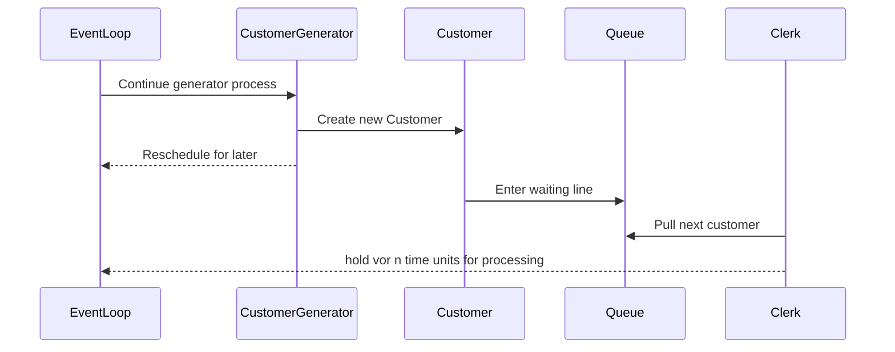

# Component

Components are the key elements of simulation.

Components can be either `data` or `active`. An `active` component has one or more process descriptions and is activated
at some point of time. You can make a data component `active` with `activate()`. An active component can become
`data` either with a `cancel()` or by reaching the end of its process method.

It is easy to create a data component by:

```kotlin
val component = Component()
```

Data components may be placed in a queue. This component will not be activated as there is no associated process method.

In order to make an active component it is necessary to first define a class. There has to be at least one sequence generator method, normally called `process`:

```
class Ship: Component(){
    override fun process() = sequence {
        ...
        yield(...)
        ...
    }
}
```

Normally, the process will contain at least one [`yield`](https://kotlinlang.org/api/latest/jvm/stdlib/kotlin.sequences/-sequence-scope/yield.html) statement. But that's not a requirement.

Creation and activation can be combined by making a new instance of the class:

```kotlin
val ship1 = Ship()
val ship2 = Ship()
val ship3 = Ship()
```


This causes three Ships to be created and to start them at Sim.process().
The ships will be named automatically `Ship.0` unless a name
is provided.

If no process method is found for `Ship`, the ship will be a data component.
In that case, it may become active by means of an `activate()` statement:

```kotlin
{!CraneProcess.kts!}
```

Effectively, creation and start of `crane1` and `crane2` is the same.

In most practical scenarios, the `process` parameter is omitted in the method signature.

Although not very common, it is possible to activate a component at a certain time or with a
specified delay:

```kotlin
ship1.activate(at=100)
ship2.activate(delay=50)
```


At time of creation it is sometimes useful to be able to set attributes, prepare for actions, etc.
This is possible in salabim by defining an __init__ and/or a setup method:

If the __init__ method is used, it is required to call the Component.__init__ method from within the
overridden method:

```kotlin
   class Ship(sim.Component):
       def __init__(self, length, *args, **kwargs):
           sim.Component.__init__(self, *args, **kwargs)
           self.length = length

   ship = Ship(length=250)
```


This sets ship.length to 250.

In most cases, the setup method is preferred, however. This method is called after ALL initialization code
of Component is executed.

```kotlin
   class Ship(sim.Component):
       def setup(self, length):
           self.length = length

   ship = Ship(length=250)
```


Now, ship.length will be 250.

Note that setup gets all arguments and keyword arguments, that are not 'consumed'  by __init__ and/or
the process call.

Only in very specific cases, __init__ will be necessary.

Note that the setup code can be used for data components as well.

## Process interaction

A component may be in one of the following states:

* data
* current
* scheduled
* passive
* requesting
* waiting
* standby
* interrupted

The scheme below shows how components can go from state to state.

|    rom/to   |     data     |   current   |    scheduled   |     passive     |   requesting  |   waiting   |    standby    |  interrupted |
|:-----------:|:------------:|:-----------:|:--------------:|:---------------:|:-------------:|:-----------:|:-------------:|:------------:|
| data        |              | activate[1] | activate       |                 |               |             |               |              |
| current     | process end  |             | yield hold     | yield passivate | yield request | yield wait  | yield standby |              |
| .           | yield cancel |             | yield activate |                 |               |             |               |              |
| scheduled   | cancel       | next event  | hold           | passivate       | request       | wait        | standby       | interrupt    |
| .           |              |             | activate       |                 |               |             |               |              |
| passive     | cancel       | activate[1] | activate       |                 | request       | wait        | standby       | interrupt    |
| .           |              |             | hold[2]        |                 |               |             |               |              |
| requesting  | cancel       | claim honor | activate[3]    | passivate       | request       | wait        | standby       | interrupt    |
| .           |              | time out    |                |                 | activate[4]   |             |               |              |
| waiting     | cancel       | wait honor  | activate[5]    | passivate       | wait          | wait        | standby       | interrupt    |
| .           |              | timeout     |                |                 |               | activate[6] |               |              |
| standby     | cancel       | next event  | activate       | passivate       | request       | wait        |               | interrupt    |
| interrupted | cancel       |             | resume[7]      | resume[7]       | resume[7]     | resume[7]   | resume[7]     | interrupt[8] |
| .           |              |             | activate       | passivate       | request       | wait        | standby       |              |

1. [1] via scheduled |n|
1. [2] not recommended |n|
1. [3] with keep_request=False (default) |n|
1. [4] with keep_request=True. This allows to set a new time out |n|
1. [5] with keep_wait=False (default) |n|
1. [6] with keep_wait=True. This allows to set a new time out |n|
1. [7] state at time of interrupt |n|
1. [8] increases the interrupt_level |n|

## Creation of a component

Although it is possible to create a component directly with `x=sim.Component()`, this 
makes it very hard to make that component into an active component,
because there’s no process method. So, nearly always we define a class based on
sim.Component ::

```kotlin
    def Car(sim.Component):
        def process(self):
            ...
```

If we then say ``car=Car()``, a component is created and it activated from process. This
process is nearly always, but not necessarily a generator method (i.e. it has at least one yield (or yield from) statement.

The result is that car is put on the future event list (for time now) and when it’s its
turn, the component becomes current.

It is also possible to set a time at which the component (car) becomes active, like `car=Car(at=10)`.

And instead of starting at process, the component may be initialized to start at another (generator) method,
like ``car=Car(process='wash')``.

And, finally, if there is a process method, you can disable the automatic activation (i.e.
make it a data component) , by specifying ``process=''``.

If there is no process method, and process= is not given, the component will be a data component.

## activate

Activate is the way to turn a data component into a live component. If you do not specify a process,
the (usually generator) function process is assumed. So you can say ::

```kotlin
    car0 = Car(process='')  # data component
    car0.activate()  # activate @ process if exists, otherwise error
    car1 = Car(process='')  # data component
    car1.activate(process='wash')  # activate @ wash
```


* If the component to be activated is current, always use yield self.activate. The effect is that the
  component becomes scheduled, thus this is essentially equivalent to the preferred hold method.
* If the component to be activated is passive, the component will be activated at the specified time.
* If the component to be activated is scheduled, the component will get a new scheduled time.
* If the component to be activated is requesting, the request will be
  terminated, the attribute failed set and the component will become scheduled. If keep_request=True
  is specified, only the fail_at will be updated and the component will stay requesting.
* If the component to be activated is waiting, the wait will be
  terminated, the attribute failed set and the component will become scheduled. If keep_wait=True
  is specified, only the fail_at will be updated and the component will stay waiting.
* If the component to be activated is standby, the component will get a new scheduled time and become
  scheduled.
* If the component is interrupted, the component will be activated at the specified time.
  
### hold
Hold is the way to make a, usually current, component scheduled.


* If the component to be held is current, the component becomes scheduled for the specified time. Always
  use yield self.hold() is this case.
* If the component to be held is passive, the component becomes scheduled for the specified time.
* If the component to be held is scheduled, the component will be rescheduled for the specified time, thus
  essentially the same as activate.
* If the component to be held is standby, the component becomes scheduled for the specified time.
* If the component to be activated is requesting, the request will be terminated, the attribute failed 
  set and the component will become scheduled. It is recommended to use the more versatile activate method.
* If the component to be activated is waiting, the wait will be
  terminated, the attribute failed set and the component will become scheduled. It is recommended to
  use the more versatile activate method.
* If the component is interrupted, the component will be activated at the specified time.

### passivate

Passivate is the way to make a, usually current, component passive. This is essentially the
same as scheduling for time=inf.

* If the component to be passivated is current, the component becomes passive. Always
  use yield self.passivate() is this case.
* If the component to be passivated is passive, the component remains passive.
* If the component to be passivated is scheduled, the component becomes passive.
* If the component to be held is standby, the component becomes passive.
* If the component to be activated is requesting, the request will be terminated, the attribute failed 
  set and the component becomes passive. It is recommended to use the more versatile activate method.
* If the component to be activated is waiting, the wait will be
  terminated, the attribute failed set and the component becomes passive. It is recommended to
  use the more versatile activate method.
* If the component is interrupted, the component becomes passive.

### cancel

Cancel has the effect that the component becomes a data component.

* If the component to be cancelled is current, always use yield self.cancel().
* If the component to be cancelled is passive, scheduled, interrupted  or standby, the component
  becomes a data component.
* If the component to be cancelled is requesting, the request will be terminated, the attribute failed 
  set and the component becomes a data component.
* If the component to be cancelled is waiting, the wait will be terminated, the attribute failed 
  set and the component becomes a data component.

### standby

Standby has the effect that the component will be triggered on the next simulation event.

* If the component is current, use always yield self.standby()
* Although theoretically possible, it is not recommended to use standby for non current components.

### request

Request has the effect that the component will check whether the requested quantity from a resource is available. It is
possible to check for multiple availability of a certain quantity from several resources.

Instead of checking for all of number of resources, it is also possible to check for any of a number of resources, by setting the oneof parameter to True.

By default, there is no limit on the time to wait for the resource(s) to become available. But, it is possible to set
a time with fail_at at which the condition has to be met. If that failed, the component becomes current at the given point of time.
The code should then check whether the request had failed. That can be checked with the Component.failed() method.

If the component is canceled, activated, passivated, interrupted or held the failed flag will be set as well.

* If the component is current, always use yield self.request()
* Although theoretically possible it is not recommended to use request for non current components.

### wait

Wait has the effect that the component will check whether the value of a state meets a given condition.
available. It is
possible to check for multiple states.
By default, there is no limit on the time to wait for the condition(s) to be met. But, it is possible to set
a time with fail_at at which the condition has to be met. If that failed, the component becomes current at the given point of time.
The code should then check whether the wait had failed. That can be checked with the Component.failed() method.

If the component is canceled, activated, passivated, interrupted or held the failed flag will be set as well.

* If the component is current, use always yield self.wait()
* Although theoretically possible it is not recommended to use wait for non current components.

### interrupt

With interrupt components that are not current or data can be temporarily be interrupted. Once a resume is called for
the component, the component will continue (for scheduled with the remaining time, for waiting or requesting possibly with
the remaining fail_at duration).

## Usage of process interaction methods within a function or method

There is a way to put process interaction statement in another function or method.
This requires a slightly different way than just calling the method.

As an example, let's assume that we want a method that holds a component for a number of minutes and that the time unit is actually seconds. 
So we need a method to wait 60 times the given parameter

We start with a not so elegant solution: ::

```kotlin
    class X(sim.Component):
        def process(self):
            yield self.hold(60 * 2)
            yield self.hold(60 * 5)
```

Now we just addd a method hold_minutes: ::

```kotlin
        def hold_minutes(self, minutes):
            yield self.hold(60 * minutes)
```

Direct calling hold_minutes is not possible. Instead we have to say: ::

```kotlin
    class X(sim.Component):
       def hold_minutes(self, minutes):
            yield self.hold(60 * minutes)
 
       def process(self):
            yield from self.hold_minutes(2)
            yield from self.hold_minutes(5)
```

All process interaction statements including passivate, request and wait can be used that way!

So remember if the method contains a yield statement (technically speaking that's a generator method), it should be called with ``yield from``.

##  Using priority and urgent to control order of execution

All process interaction methods supports a priority and urgent parameter:

With priority it is possible to sort a component before or after other components, scheduled for the same time.
Note that the urgent parameters only applies to components scheduled with the same time and same priority.

The priority is 0 by default.

This is particularly useful for race conditions. It is possible to change the priority of a component
by cancelling it prior to activating it with another priority.

The priority can be accessed with the new Component.scheduled_priority() method.

## Status of a component

The status of a component can be any of:

* sim.data = "data"
* sim.current = "current"
* sim.standby = "standby"
* sim.passive = "passive"
* sim.interrupted = "interrupted"
* sim.scheduled = "scheduled"
* sim.requesting = "requesting"
* sim.waiting = "waiting"

The status is automatically tracked in the status level monitor. Thus it possible
to check how long a component has been in passive state with ::

    passive_duration = component.status.value_duration("passive")
  
And it is possible to print a histogram with all the statuses a component has been in with ::

## Execution Order

Order is defined by scheduled time. To avoid race conditions execution order be fine-tuned using `priority` and `urgent` which are supported for all methods that result in a rescheduling of a component, namely  `wait`, `request`,  `activate` and `reschedule`

## Generator

Def
> A `Component` that contains at least one yield.


## Queue

Kalasim builds on top of the JVM's [PriorityQueue](https://docs.oracle.com/javase/7/docs/api/java/util/PriorityQueue.html)  to model waiting lines etc. Conceptual our implementation is very similar to salabim's [queue](
https://www.salabim.org/manual/Queue.html).


A typical usecase would be a generator process (materal, customers, etc.) that is consumed by other components. In the following example a [`Generator`](#generator) is creating new `Customer`s which are entering a waiting line `Queue`. This queue is consumed by a clerk which take one customer at a time and goes on [`hold`](#hold) for processing. See [here](https://github.com/holgerbrandl/kalasim/blob/master/src/test/kotlin/org/kalasim/examples/bank/oneclerk/Bank1clerk.kt) for the complete implementation.

