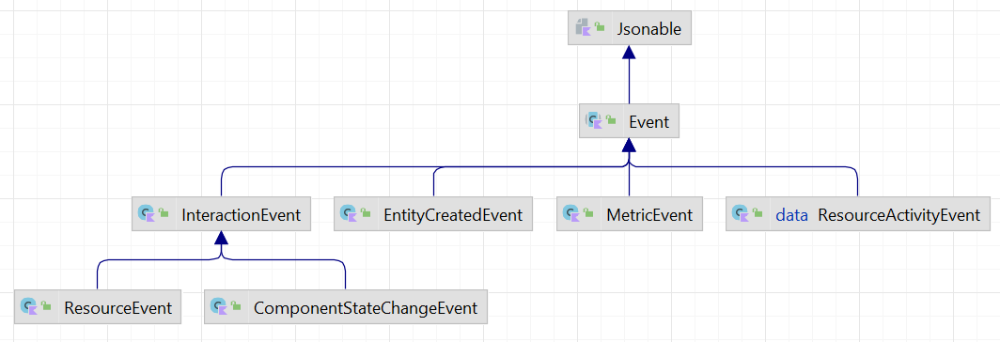

# Events

Every simulation includes an internal _event bus_ to provide another way to enable connectivity between simulation [components](component.md). Components can use `log(event)` to publish to the event bus from their [process definitions](component.md#process-definition).

Also, events can be used to study dynamics in a simulation model. We may want to monitor [component](component.md) creation, the [event queue](basics.md#event-queue), or the [interplay](component.md#process-interaction) between simulation entities, or custom business dependent events of interest. We may  want to trace which process caused an event, or which processes waited for resource. Or a model may require other custom state change events to be monitored. 


## How to create an event?


To create a custom event type, we need to subcalss `org.kalasim.Event`. Events can be published to the internal event bus using `log()` in [process definitions](component.md#process-definition). Here's a simple [example](../../../src/test/kotlin/org/kalasim/examples/api/CustomEvent.kts)

```kotlin hl_lines="1000"
{!api/CustomEvent.kts!}
```

In this example, we have created custom simulation event type `MyEvent` which stores some additional context detail about the process. This approach is very common: By using custom event types when building process models with `kalasim`, state changes can be consumed very selectively for analysis and visualization.

## How to listen to events?

The event log can be consumed with one more multiple `org.kalasim.EventListener`s. The classical  publish-subscribe pattern is used here. Consumers can easily route events into arbitrary sinks such as consoles, files, rest-endpoints, and databases, or perform in-place-analytics.

We can register a event handlers with `addEventListener(org.kalasim.EventListener)`. Since an `EventListener` is modelled as a [functional interface](https://kotlinlang.org/docs/fun-interfaces.html), the syntax is very concise and optionally supports generics:

```kotlin
createSimulation { 
    // register to all events
    addEventListener{ it: MyEvent -> println(it)}

    // ... or without the lambda arument just with
    addEventListener<MyEvent>{  println(it)}

    // register listener only for resource-events
    addEventListener<ResourceEvent>{ it: ResourceEvent -> println(it)}    
}
```

Event listener implementations typically do not want to consume all events but filter for specific types or simulation entities. This filtering can be implemented in the listener or by providing a the type of interest, when adding the listener.


## Event Collector

A more selective monitor that will just events of a certain type is the event collector. It needs to be created before running the simulation (or from the moment when events shall be collected).

```kotlin
class MyEvent(time : SimTime) : Event(time)

// run the sim which create many events including some MyEvents
env.run()

val myEvents :List<MyEvent> = collect<MyEvent>()

// or collect with an additional filter condition
val myFilteredEvents :List<MyEvent> = collect<MyEvent> {
    it.toString().startsWith("Foo")
}

// e.g. save them into a csv file with krangl
myEvents.asDataFrame().writeCsv(File("my_events.csv"))
```
This collector will have a much reduced memory footprint compared to the [event log](#events).

## Event Log

Another built-in event listener is the trace collector, which simply records **all** events and puts them in a list for later analysis.

For example to fetch all events in retrospect related to resource requests we could filter by the corresponding event type

```kotlin
//{!api/EventCollector.kts!}
```

## Asynchronous Event Consumption

Sometimes, events can not be consumed in the simulation thread, but must be processed asynchronously. To do so we could use a custom thread or we could setup a [coroutines channel](https://kotlinlang.org/docs/reference/coroutines/channels.html) for log events to be consumed asynchronously. These technicalities are already internalized in `addAsyncEventLister` which can be parameterized with a custom [coroutine scope](https://kotlinlang.org/docs/coroutines-basics.html) if needed. So to consume, events asynchronously, we can do:

```kotlin
//{!analysis/LogChannelConsumerDsl.kts!}
```

In the example, we can think of a channel as a pipe between two coroutines. For details see the great article [_Kotlin: Diving in to Coroutines and Channels_](
https://proandroiddev.com/kotlin-coroutines-channels-csp-android-db441400965f).


## Internal Events


`kalasim` is using the event-bus extensively to publish a rich set of built-int events.

* [Interactions](component.md#process-interaction) via `InteractionEvent`
* Entity creation via `EntityCreatedEvent` 
* Resource requests, see [resource events](resource.md#events).



To speed up simulations, internal events can be [disabled](advanced.md#continuous-simulation).

### Component Logger

For internal interaction events, the library provides a  built-in textual logger. With component logging being enabled, `kalasim` will print a tabular listing of component state changes and interactions. Example:

```
time      current component        component                action      info                          
--------- ------------------------ ------------------------ ----------- -----------------------------
.00                                main                     DATA        create
.00       main
.00                                Car.1                    DATA        create
.00                                Car.1                    DATA        activate
.00                                main                     CURRENT     run +5.0
.00       Car.1
.00                                Car.1                    CURRENT     hold +1.0
1.00                               Car.1                    CURRENT
1.00                               Car.1                    DATA        ended
5.00      main
Process finished with exit code 0
```

Console logging is not active by default as it would considerably slow down larger simulations. It can be [enabled](basics.md#configuring-a-simulation) when creating a simulation.

```kotlin
createSimuation(enableComponentLogger = true){
    // some great sim in here!!
}
```

!!!note 
    The user can change the width of individual columns with `ConsoleTraceLogger.setColumnWidth()`

## Logging Framework Support

It's very easy to also log `kalasim` events via another logging library such as [log4j](https://logging.apache.org/log4j), [https://logging.apache.org/log4j/2.x/](https://www.slf4j.org), [kotlin-logging](https://github.com/MicroUtils/kotlin-logging) or the jdk-bundled [util-logger](https://docs.oracle.com/javase/7/docs/api/java/util/logging/Logger.html). This is how it works:

```kotlin
//{!api/LoggingAdapter.kts!}
```


For an in-depth logging framework support discussion see [#40](https://github.com/holgerbrandl/kalasim/issues/40).

## Tabular Interface

A typesafe data-structure is usually the preferred for modelling. However, accessing data in a tabular format can also be helpful to enable statistical analyses. Enabled by krangl's `Iterable<T>.asDataFrame()` extension, we can  transform  records, events and simulation entities easily into tables. This also provides a semantic compatibility layer with other DES engines (such as [simmer](about.md#simmer)), that are centered around tables for model analysis.

We can apply such a transformation simulation `Event`s. For example, we can apply an instance filter to the recorded log to extract only log records relating to resource requests. These can be transformed and converted to a csv with just:

```kotlin
// ... add your simulation here ...
data class RequestRecord(val requester: String, val timestamp: Double, 
            val resource: String, val quantity: Double)

val tc = sim.get<TraceCollector>()
val requests = tc.filterIsInstance<ResourceEvent>().map {
    val amountDirected = (if(it.type == ResourceEventType.RELEASED) -1 else 1) * it.amount
    RequestRecord(it.requester.name, it.time, it.resource.name, amountDirected)
}

// transform data into data-frame (for visualization and stats)  
requests.asDataFrame().writeCSV("requests.csv")
```

The transformation step is optional, `List<Event>` can be transformed `asDataFrame()` directly.


## Events in Jupyter

When working with jupyter, we can harvest the kernel's built-in rendering capabilities to render events. Note that we need to filter for specific event type to capture all attributes.


For a fully worked out example see one of the [example notebooks](https://github.com/holgerbrandl/kalasim/blob/master/docs/userguide/docs/examples/bridge_game.ipynb) .