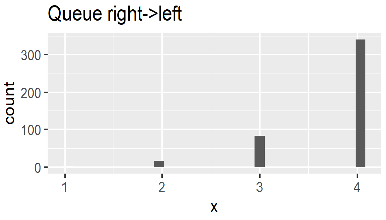
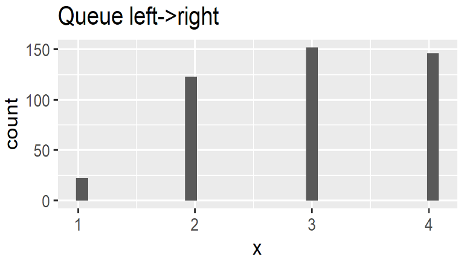

<!--# Ferryman-->

A wild river, one boat only, and a patient ferryman transporting batches of passengers across the body of water.

Covers:

* [Batching](../collections.md#batching) to consume queue elements in defined blocks
* [Monitors](../monitors.md) for stats and visualization

{: .center}

<p align="center">
<i>Stanhope Forbes - A Ferryman at Flushing (oil on canvas, CC0 1.0)</i>
</p>

## Simulation

To form groups of passengers before passing the waters, we use `batch()` in the ferryman's [process definition](../component.md#process-definition). It has multiple arguments:

* A mandatory [queue](../collections.md#queue) with elements of type `<T>` to be consumed
* The size of the batch to be created. A positive integer is expected here.
* An optional timeout describing how long it shall wait before forming an incomplete/empty batch

`batch` will return a list of type `<T>` of size `batchSize` or lesser (and potentially even empty) if timed out before filling the batch.

```kotlin
//{!Ferryman.kts!}
```

## Analysis

The ferryman tries to max out his boat with 4 passengers, but after 10 minutes he will start anyway (even if the boat is entirely emtpy). `kalasim` will suspend execution when using `batch()` until `timeout` or indefinitely (if `timeout` is not set).

Since both banks have different arrival distributions, we observe different batch-size patterns:


**Right→Left**

Since passengers on the right bank arrive with a higher rate (that is shorter inter-arrival time between `0` and `12`), the ferry is usually packed with people. Only occasionally the ferryman traverses from left to right banks with less than 4 passengers.




**Left→Right**

Because of a slightly higher inter-arrival time (up to `15` minutes) on the left banks, it often happens that the ferry starts its journey across the river with some seats unoccupied. On average, just `3` seats are taken. However, at least during this simulation we did not encounter a passing with just the ferryman and his thoughts.


