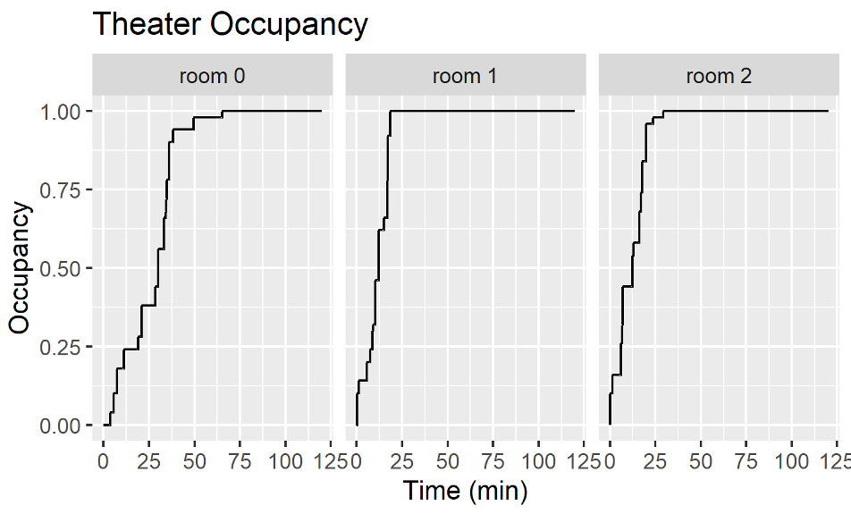

# Movie Theater


Covers:

* Resources
* Event operators
* Shared events

This example models a movie theater with one ticket counter selling tickets for three movies (next show only). People arrive at random times and try to buy a random number (1–6) tickets for a random movie. When a movie is sold out, all people waiting to buy a ticket for that movie renege (leave the queue).

The movie theater is just a type to assemble all the related data (movies, the counter, tickets left, collected data, ...). The counter is a Resource with a capacity of one.

The moviegoer process function starts waiting until either it’s his turn (it acquires the counter resource) or until the sold out signal is triggered. If the latter is the case it reneges (leaves the queue). If it gets to the counter, it tries to buy some tickets. This might not be successful, e.g. if the process tries to buy 5 tickets but only 3 are left. If less than two tickets are left after the ticket purchase, the sold out signal is triggered.

Moviegoers are generated by the customer arrivals process. It also chooses a movie, and the number of tickets for the moviegoer.


```kotlin
//{!MovieRenege.kt!}
```

The example also details out how we could now easily plot the occupancy progressions using automatically captured [monitoring](../monitors.md) data.



Adopted from [SimJulia example](https://simjuliajl.readthedocs.io/en/stable/examples/2_movie_renege.html).
