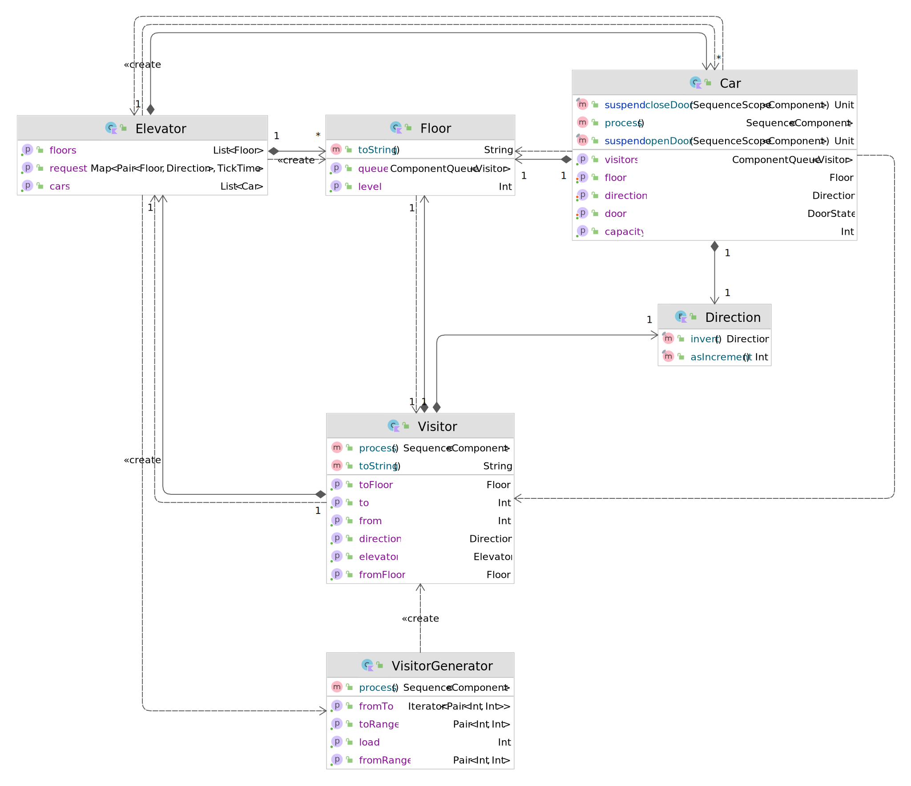

<!--## Elevators-->

In this logistics model, we simulate an office tower. There are N lifts with capacity limited cars. Passengers arrive at different floors with different rates and press buttons indicating the direction of their target floor. The cars have a defined speed, and clearly it takes time to open/close its doors before passengers can enter & leave.

{: .center}

Parameters

* Origin/destination distribution of visitors
* Number of elevators
* Capacity of each elevator
* Number of floors
* Times for moving between floors, for opening/closing doors, and for passenger to move or out a car

## Implementation

See [`Elevator.kt`](https://github.com/holgerbrandl/kalasim/blob/master/src/main/kotlin/org/kalasim/examples/elevator/Elevator.kt) for the implementation.

The implementation is adopted from [salabim's elevator](https://github.com/salabim/salabim/blob/master/sample%20models/Elevator.py) example.

## Model

The following diagram shows the key players of the model. The diagram was automatically created using [Intellij's](https://www.jetbrains.com/idea/) UML capabilities. 

The simulation [environment](../basics.md#simulation-environment) is modelled in `Elevator`. Multiple `VisitorGenerator`s produce `Visitor`s at different rates.  Each visitor has a target `Floor`, which defines the button (up or down) she is pressing to request a car. `Car`s - i.e. the elevator cabins - are the workhorse of the model. They have a fixed capacity, a current occupancy, a current floor and a [state](../state.md) for the door. The cars and the visitors have associated [process](../component.md#process-definition) definitions to drive the dynamics of the model.

## Process Animation

The model was also animated ([source](https://github.com/holgerbrandl/kalasim/blob/master/modules/animation/src/test/kotlin/org/kalasim/animation/examples/elevator/ElevatorAnimated.kt)) to illustrate the power of kalasim's [animation](../animation/animation.md) API.

  <iframe width="700" height="500" src="https://www.youtube.com/embed/KwBeon-rXdw" frameborder="0" allowfullscreen></iframe>

