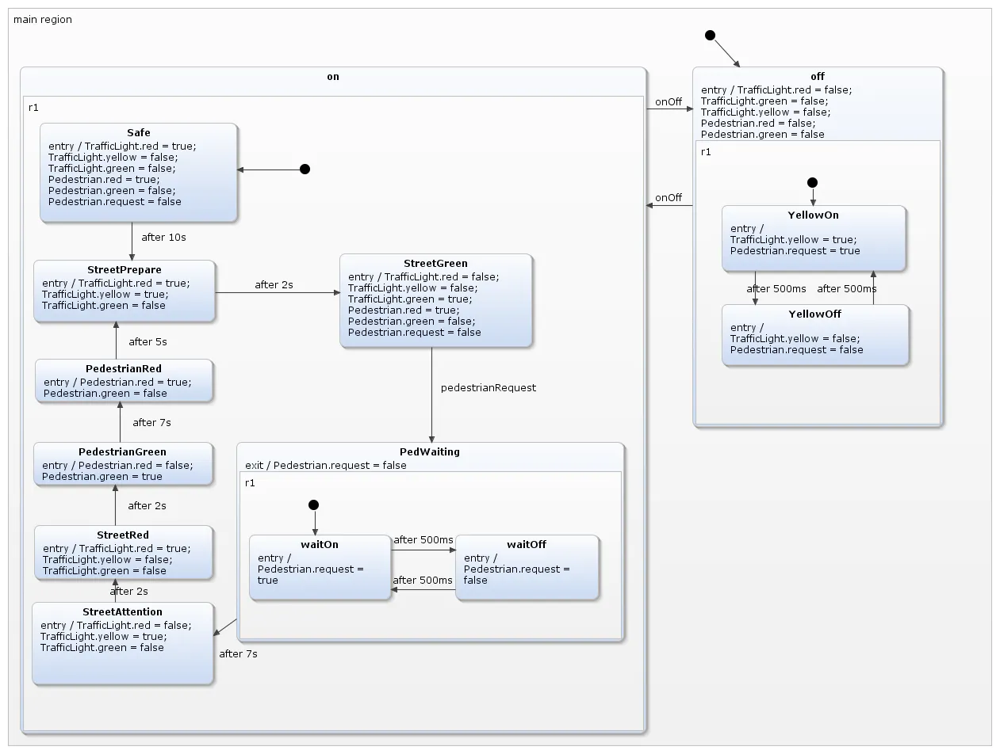
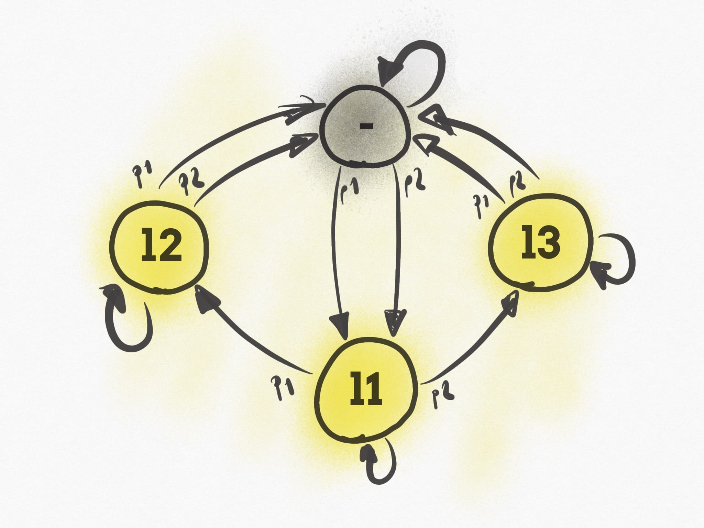

## References

See overview presentation https://speakerdeck.com/corneil/kfsm-a-kotlin-dsl-for-finite-state-machines or project website https://open.jumpco.io/projects/kfsm

Most popular FSM library https://github.com/statelyai/xstate (javascript)

Great conceptual overview https://flaviocopes.com/finite-state-machines/

## Nice Examples

Pedestrian Crossing https://www.hackster.io/robin-herrmann/traffic-lights-using-finite-state-machine-in-c-for-arduino-26169c

https://flaviocopes.com/finite-state-machines/

house, with one door, 2 buttons and 3 lights.

    
